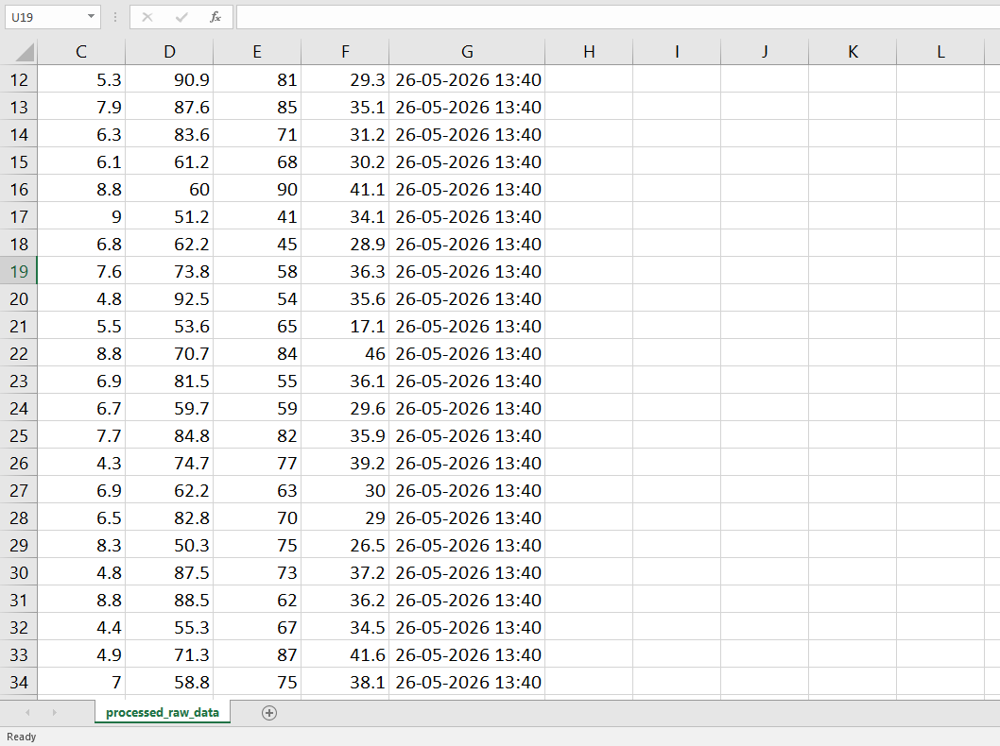
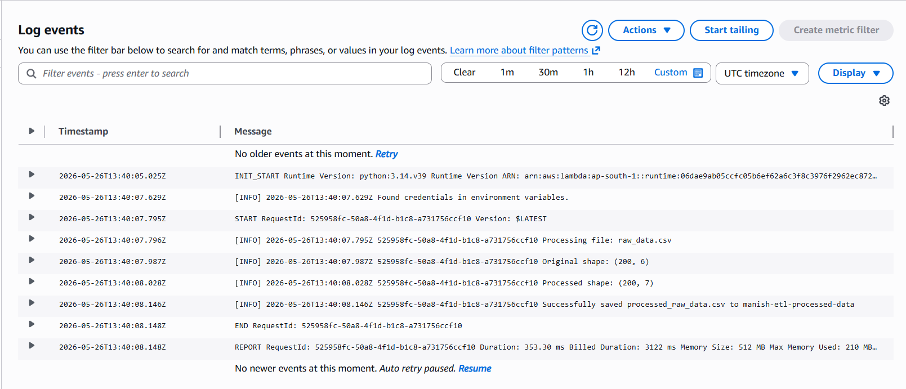

# AWS ETL Pipeline 🔄

A serverless ETL pipeline built on AWS that automatically cleans CSV data 
and loads the processed output to S3 using Lambda.

## 🔗 How It Works
1. Upload a CSV file to `manish-etl-raw-data` S3 bucket
2. Lambda function triggers automatically
3. Pandas reads and cleans the data (removes null rows)
4. Adds a `processed_date` timestamp column
5. Saves cleaned CSV to `manish-etl-processed-data` bucket

## 🛠️ AWS Services Used
- **AWS S3** — Raw and processed data buckets
- **AWS Lambda** — Serverless ETL function (Python 3.14)
- **AWS CloudWatch** — Logging and monitoring
- **AWS IAM** — Role and permissions
- **AWS SDK Pandas Layer** — For data processing

## 📁 Project Structure
aws-etl-pipeline/
├── lambda_function.py        ← ETL Python code
├── sample_data/
│   ├── raw_data.csv          ← Input data
│   └── processed_raw_data.csv ← Cleaned output
├── s3_processed_output.png   ← Proof of S3 output
├── cloudwatch_logs.png       ← Proof of CloudWatch logs
└── README.md

## 📸 Proof of Working Pipeline
### S3 Output

### CloudWatch Logs

## 💡 What This Pipeline Does
| Step | Action |
|------|--------|
| Extract | Reads CSV from S3 using boto3 |
| Transform | Removes null rows + adds processed_date column |
| Load | Saves cleaned CSV back to S3 |

## 👤 Author
**Manish Ram Kondoz** — Data Engineer
- GitHub: https://github.com/ManishRamKP
- LinkedIn: https://linkedin.com/in/manishramkondoz
- Email: manishramk@gmail.com
